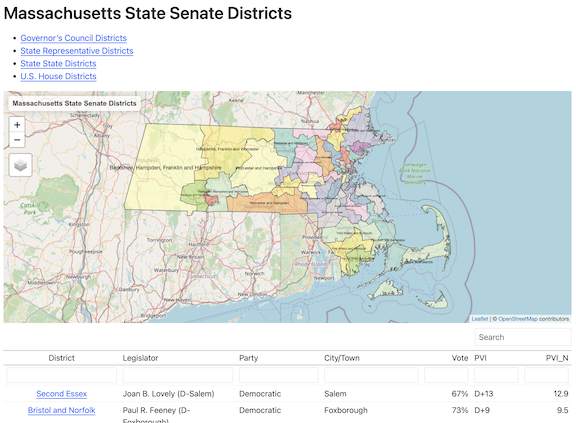
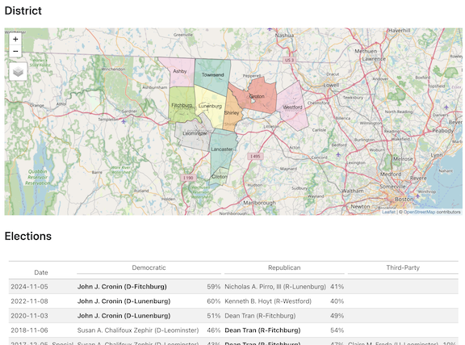

## Massachusetts Legislative District Atlas

- [State Representative Districts](districts/pages/state-rep-districts.html)
- [State Senate Districts](districts/pages/state-senate-districts.html)
- [Governor's Council Districts](districts/pages/gov-council-districts.html)
- [U.S. House Districts](districts/pages/us-house-districts.html)

### Fun Facts

#### The largest and smallest State Rep districts

- While every `mapoli` State Representative district has approximately
  the same population (currently about 44,000 people) the districts
  vary widely in geographic size.
- The smallest State Representative district in terms of area is
  Speaker Aaron Michlewitz's [Third
  Suffolk](districts/pages/state-rep-third-suffolk.html) district
  coming in at a petite 1.36 square miles.
- The largest State Representative district in area is the [Third
  Berkshire](districts/pages/state-rep-third-berkshire.html) district
  represented by Leigh Davis of Great Barrington. The district is a
  whopping 551 square miles and contains 18 separate municipalities.

### Statewide District Overviews and Comparisons

The district atlas contains statewide maps for each legislative office
with district-to-district comparison tables on political and
demographic data.
   

### Per-District Map, Demographics, and Election Information

There is also a separate page for each of the 160 State
Representative, 40 State Senate, 9 U.S. House, and 8 Governor's
Council districts with demographic details and electon results back to
1990.

## Census-Based Demographics

- Code for extracting fine-grained Census data: [ma_census.R](demographics/ma_census.R)
- Data at the level of legislative district and precinct: [data](demographics/data)

## GIS Data

- [Shapefiles](gis/shp)
- [GeoJSON](gis/geojson)

## Partisan Voter Index (PVI) 
 
- [`pvi`](pvi) - Partisan Voter Index calculations for precincts, towns,
  counties, and legislative districts

